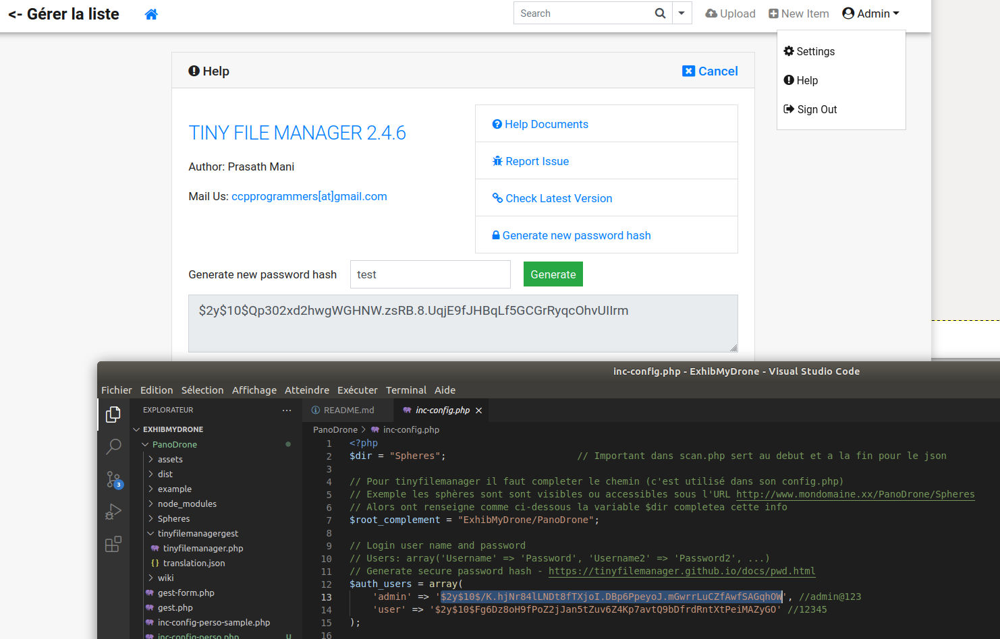

# ExhibMyDrone
Visualisation sphères et placement de points d'intérets
Visualisation des droonies et rushs d'un drone

__But__: Permettre de visualiser et d'enrichir les photos sphères prisent avec son drone, permettre de diffuser les rushs videos du drone

Pour ce faire, les logiciels suivants sont utilisés :

- [Photo Sphères Viewer](https://photo-sphere-viewer.js.org/) de Damien Sorel pour l'affichage et le marquage de point d'intérêt
- [Cute File Browser](https://tutorialzine.com/2014/09/cute-file-browser-jquery-ajax-php) de Nick Anastasov pour parcourir les photos
- [TinyFileManager](https://tinyfilemanager.github.io) de CCP Programmers pour gérer les fichiers devant être presentés
- [CkEditor](https://ckeditor.com) de CKSource pour la saisie des du texte de description des points d'interêts (marqueurs)

## Principe de fonctionnement : 

Cute File Browser permet de se déplacer dans l'arborescence des photos sphères, puis lors du clique sur la tuile info de la photosphère on passe la main à Photo Sphères View qui permet alors de naviguer visuellement dans la sphère et afficher les marqueurs.  

Cute File Browser est légérement modifié, il scan les fichiers .jpg, puis insert le nom du fichier dans une base de donnée sqlite qui sera alors enrichie pour donner un titre et des infos de marqueurs.  

Photo Sphère Viewer est utilisé soit pour visualiser les sphères ainsi que les points d'intérêts soit pour créer ou mettre à jour ces derniers. Pour ce faire il recupére ou écrit les infos marqueurs dans la base de données.

TinyFileManager est utilisé pour ajouter supprimer les fichiers à presenter.

## Pré-requis :
Un hergement web supportant php  

Base de données sqlite3 pour mémoriser les infos persistantes.

La fonction de scan des fichiers sphères et vidéos est en php le reste en javascript.

## Format des fichiers :

- Sphères & panorama : Actuellement ont été testés uniquement les sphères natives obtenues en exportant depuis la galerie DJI. 
Le DJI mini 2 produit un jpg directement exploitable.
- Vidéos : Les rushs videos bruts du DJI ne sont pas lisibles par les navigateurs, il faut pour l'instant passer 
par un transcodage il est possible que ce soit juste une histoire d'entête mp4 l'idée serait alors de l'ajouter 
à la volée en début de fichier mais je n'ai pas encore réussi.

## Installation sur son serveur :

En théorie n'importe quel serveur web disposant du langage PHP et sa librairie sqlite3 permettent le fonctionnement natif de l'appli. 

La façon la plus simple et de télécharger le zip https://github.com/fran6t/ExhibMyDrone/archive/refs/heads/master.zip
(Attention il est gros car il y a plusieurs sphères et 2 vidéos 155Mo au moment ou j'ecris cela)

Nota: Le respect des minuscules majuscules est important.

Une fois dezippé sur votre ordi, effectuez le transfert du répertoire ExhibMyDrone et de ses sous repertoires sur votre hebergement avec filezilla par exemple.
Le transfet terminé si vous avez fait le transfert du répertoire à la racine de votre site alors http://mondomaine.xx/ExhibMyDrone doit fonctionner
Dans le bas de l'écran en dessous des crédits vous avec le lien pour l'admin en cliquant le mot ici des sphères quand vous êtes dans les sphères et l'admin vidéos quand vous êtes dans les vidéos
Le login mot de passe en dur dans l'appli est: admin avec le mot de passe admin@123  

Il vous faudra changer le mot de passe rapidement pour cela vous avez un generateur de mot de passe dans la partie aide de tinyfilemanager vous entrez le mot de passe souhaité puis vous allez remplacer la clef obtenue dans les fichiers inc-config.php présents dans les sous-repertoires PanoDrone et VideoDrone 
Oui il y a deux fichiers inc-config.php à mettre à jour car pour l'instant PanoDrone et VideoDrone sont 100% indépendant l'un de l'autre 

Sur fond blanc il s'agit du générateur de clef et sur fond noir un editeur de texte le principe est de remplacer les clefs qui sont dans le fond noir par vos clefs obtenus avec le formulaire (fond blanc) 

N'hésitez pas si je peux vous aidez trautmann@wse.fr

## Reste à faire :

- Petit doc d'explications (wiki ou readme etendu..)
- Creuser le ré-encodage des vidéos car nativement les videos DJI ne sont pas lisible par les navigateurs
- Ajouter la possibilité d'une piste son lors de la lecture d'une vidéo
- Ajouter un éditeur de sous titrage lors de la lecture d'une vidéo  

## Démo :

[Démonstration](https://d.wse.fr/ExhibMyDrone/) Juste côté affichage l'administration est laissée protégée

## divers

__Change log__:
- 20/08/2021 Ajout miniature et lien partage copiable depuis le formulaire gestion sphère
- 19/08/2021 Ajout ckeditor pour saisir les descriptions des marqueurs
- 18/08/2021 Ajout double clique pour quitter une sphère
- 15/08/2021 Changement nom du projet
- 12/08/2021 Fusion de deux projets pour faire un portail de présentation de ses prises de vues de drone

__Captures écrans__:

Ici deux marqueurs, 1 sur le bâtiment et 1 sur camping car

Volet détail sur le marqueur ouvert

Bar de navigation dans la sphère et vers marqueurs en bas et à droite

Formulaire de saisie des marqueurs

Gestionnaire des sphères

Gestionnaire des fichiers

