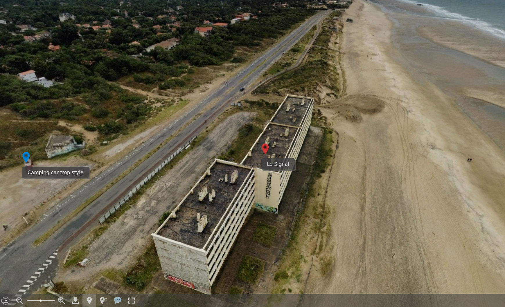
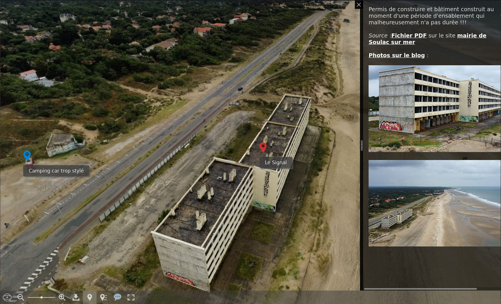
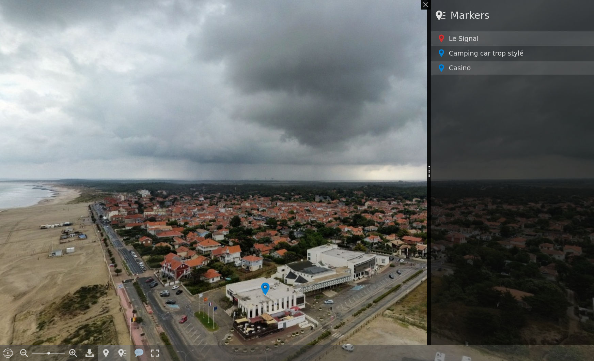
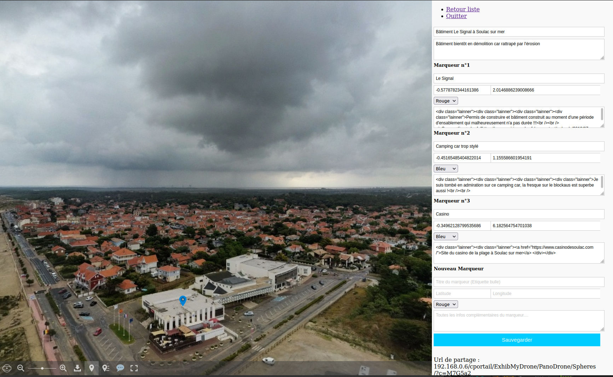
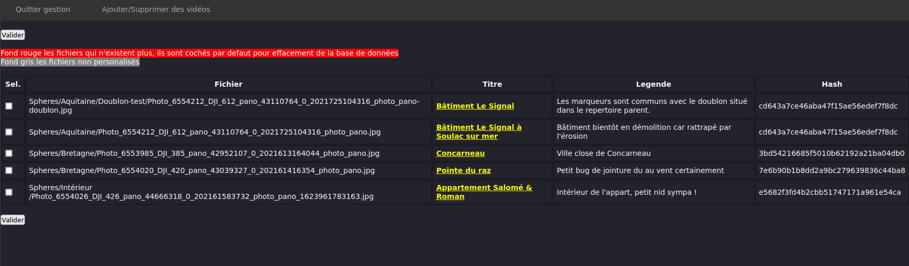
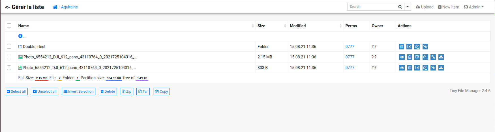

# ExhibMyDrone

__Goal__: Make it possible to visualize and enrich the spherical photos taken with his drone, to broadcast the drone's video rushes.

To do this, the following software is used :

- [Photo Sphères Viewer](https://photo-sphere-viewer.js.org/) by Damien Sorel for displaying and marking points of interest;
- [Cute File Browser](https://tutorialzine.com/2014/09/cute-file-browser-jquery-ajax-php) by Nick Anastasov to browse photo and video directories;
- [TinyFileManager](https://tinyfilemanager.github.io) by CCP Programmers o manage the files to be presented;
- [CkEditor](https://ckeditor.com) by CKSource for entering the description text of points of interest (markers).

Useful software to make 4K spheres from DJI mini air 2 :
- [Rawtherapee](https://www.rawtherapee.com/) for the development of raw files
- [Hugin](http://hugin.sourceforge.net/) panorama stitching software

## Features :
- Spheres visualization including :
    - Addition deletion of spheres (integrated file manager);
    - Addition of points of interest with additional text (via simple form);
    - Centering when opening on a point of interest;
    - Private sphere;
    - Link for direct sharing.
- Viewing droonies and rushes from a drone :
    - Added deletion of videos (integrated file manager).

## Principle of operation : 

Cute File Browser allows you to move in the tree of spheres photos, then when you click on the info tile of the photosphere, you switch the hand to Photo Spheres Viewer

Photo Spheres Viewer then allows you to visually navigate in the sphere and display the markers (POI).

Cute File Browser is slightly modified, it scans .jpg files, then inserts the name of the file in a sqlite database which will then be enriched to give a title and marker info.

TinyFileManager is used to add delete files to present.

## Prerequisites :
A web hosting supporting php  

Sqlite3 database to store persistent info.

The function of scanning spheres and videos files is in php the rest in javascript.

## File format :

- Spheres & panorama : 
    - Currently, only the native spheres obtained by exporting from the DJI gallery, and those assembled with the Hugin software have been tested;
    -Raw images developed with [rawtherapee](https://www.rawtherapee.com/) and assembled with [Hugin](http://hugin.sourceforge.net/). 

- Vidéos : 
    - The raw DJI video rushes are not readable by browsers, it is necessary for the moment to pass
by a transcoding it is possible that it is just a story of mp4 header the idea would be to add it
on the fly at the beginning of the file but I haven't succeeded yet.

## Installation on its server :

In theory, any web server using the PHP language and its sqlite3 library allows the native operation of the app. 

The easiest way and download the zip https://github.com/fran6t/ExhibMyDrone/archive/refs/heads/master.zip

Note: Respect for lower case letters is important.

Once unzipped on your computer, transfer the ExhibMyDrone directory and its sub directories to your accommodation with filezilla for example.
The transfer is complete if you have transferred the directory to the root of your site then http: //myomaine.xx/ExhibMyDrone must work
At the bottom of the screen below the credits you will find the link for the admin

At the first launch you will have to change the manual access key and the password

Do not hesitate to contact me if I can help you it is with pleasure trautmann@wse.fr

## File name and structure :

For the spheres, it suffices to place the files in the desired directories and subdirectories, however :

    - Directory names ending in .d are reserved for source images of spheres of the same name in .jpg
    - The names of spheres with the character string -p- will only be visible by a shared link
    - Thumbnails are generated automatically invisible in the admin but visible by the manager tinyfilemanager or equivalent filezilla

Example of a sphere whose file name is dji-maison.jpg placed in a Sphere / My-Maison directory with the original images that have been assembled we will have:

/Sphere/My-Maison/dji-maison.jpg

We create a directory 
/Sphere/My-Maison/dji-maison.d

In which we place the 26 DJI_0001.jpg files which gives
/Sphere/My-Maison/dji-maison.d/DJI_0001.jpg
/Sphere/My-Maison/dji-maison.d/DJI_0002.jpg
...
/Sphere/My-Maison/dji-maison.d/DJI_0025.jpg
/Sphere/My-Maison/dji-maison.d/DJI_0026.jpg

The following thumbnails will be created automatically
/Sphere/My-Maison/dji-maison-MinX0200.jpg
/Sphere/My-Maison/dji-maison-MinX0600.jpg

## Todo list :
- Add link to allow sharing in a frame;
- Small explanatory documentation (wiki or extended readme ..);
- Study the re-encoding of videos because native DJI videos are not readable by browsers;
- Add the possibility of a sound track when playing a video;
- Add subtitles when playing a video.  

## Démo :

   
[Démonstration](https://d.wse.fr/ExhibMyDrone/) only the frontend

## various

__Change log__:
- 16/09/2021 Start of implementation of multi-lingual version (For the moment only Readme.md README-fr.md, index.php, parametre.php)
- 11/09/2021 If the sphere construction source files are present then addition of respective markers allowing to consult the original .jpg
- 09/09/2021 If a marker is defined to be centered, the sphere then opens on it
- 01/08/2021 The files with the character string -p- in their name are invisible on the FrontEnd side except call via direct link
- 31/08/2021 Relocation of ckeditor in PanoDrone for increased independence of PanoDrone versus VideoDrone
- 29/08/2021 Implementation of a mini parameter manager on the spheres side
- 26/08/2021 PSwitching from native sqlite php to pdo to also accept mysql, php version management if php is <5.5 then no tinyfilemanager you have to place your files via filezilla or equivalent and call the administration manually with a parameter (see inc-config.php file )
- 20/08/2021 Add miniature and copyable sharing link from the sphere management form
- 19/08/2021 Added ckeditor to enter descriptions of markers
- 18/08/2021 Add double click to leave a sphere
- 15/08/2021 Project name change
- 12/08/2021 Merger of two projects (panodrone and video drone) to make a presentation portal for his drone shots

__Screenshots__:

Here two markers, 1 on the building and 1 on the motorhome

Detail pane on the open marker

Navigation bar in the sphere and towards markers at the bottom and on the right

Marker entry form

Spheres manager

File manager

